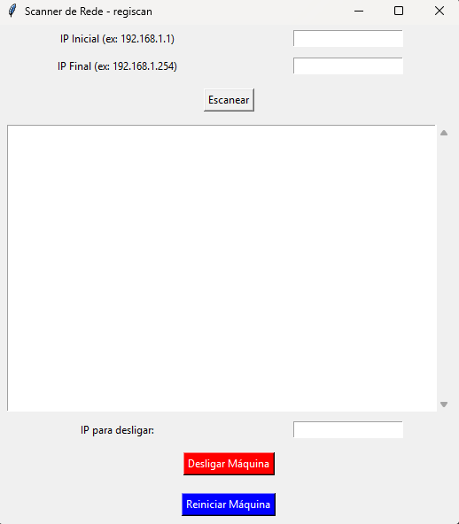

# 🔍 Scanner de Rede - **Regiscan**

Uma ferramenta simples desenvolvida em Python com interface gráfica (Tkinter) para escanear IPs ativos em uma rede local e permitir o desligamento ou reinicialização remota de máquinas via IP.



---

## ✨ Funcionalidades

- Inserção de IP inicial e final para varredura.
- Scanner de dispositivos conectados à rede local.
- Listagem dos IPs ativos encontrados.
- Funções de desligar e reiniciar máquinas remotas (via comando `shutdown` do Windows).
- Interface gráfica amigável.

---

## ⚙️ Como usar

### Pré-requisitos

- Python 3.7+
- Sistema operacional Windows (por causa dos comandos de desligamento)
- Bibliotecas utilizadas:
  - `tkinter`
  - `os`
  - `subprocess`
  - `threading`
  - `ipaddress`

### Instalação

```bash
git clone https://github.com/seuusuario/regiscan.git
cd regiscan
python Mapear_rede.py
```
### 🧪 Exemplo de uso

-Informe o IP inicial e final da varredura.
-Exemplo: 192.168.1.1 até 192.168.1.254

-Clique em Escanear.

-Os dispositivos encontrados serão listados na área de texto.

-Para desligar ou reiniciar uma máquina:

-Digite o IP no campo "IP para desligar"

-Clique em "Desligar Máquina" ou "Reiniciar Máquina"

### ⚠️ Obsevações

-É necessário que o compartilhamento administrativo remoto esteja habilitado nas máquinas de destino.
-Para desligar/reiniciar remotamente, o script usa shutdown -s e shutdown -r via os.system.

### 📜 Licença 

Este projeto está sob a licença MIT. Veja o arquivo LICENSE para mais detalhes.

### 👨‍💻 Autor
Feito por Reginaldo Queiroz Oliveira Júnior 
